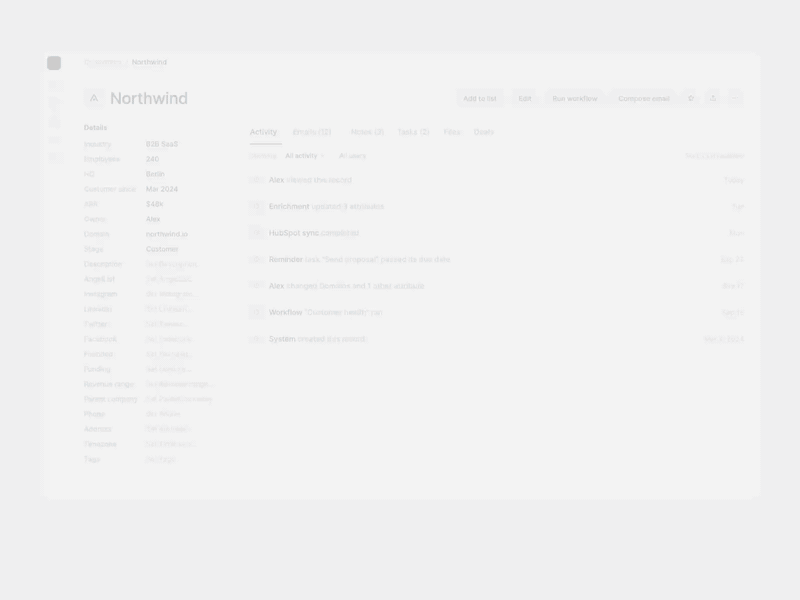

# Blueprint Before/After

A **Claude Design** skill that explains UX decisions as one continuous, step-by-step blueprint animation. Show a redesign from Before to After, or explain a single finished screen module by module.

Created by **Oğuz** · [@moguzbulbul](https://x.com/moguzbulbul) · [oguz.design](https://oguz.design)

Inspired by [Arjun Mahesh](https://x.com/arjmahesh).

[](media/example.mp4)

[Watch the full-quality video (MP4)](media/example.mp4)

## Two modes

- **Redesign** (Before + After): the live UI turns into a blueprint, the parts that change rebuild themselves, then the new UI is revealed.
- **Explain** (one screen): the design never changes. Each module turns into a blueprint in turn, and guides, dimensions and labels show why it is built that way.

## What it does

Show *why* a design works, not only what it looks like. The skill animates one screen that never cuts, in 3–6 numbered steps. Each step explains one UX decision:

1. **Focus:** the rest of the screen fades back, the module is outlined, and the problem (Redesign) or what it is (Explain) appears.
2. **Blueprint in:** a scan line sweeps down and turns the whole screen into a cyan blueprint drawing.
3. **Construct** (Redesign): only the parts that change move, resize or merge.
   **Annotate** (Explain): nothing moves; handles, guides, dimension lines and labels draw the reasoning.
4. **Reveal:** the scan line sweeps again and the real UI appears: the new one in Redesign, the same one in Explain.
5. **Hold:** the fix (Redesign) or the why (Explain) sentence fades in, then the next step starts.

The skill also carries the rules that keep it clean: no text over moving parts, invisible old → new swaps, staggered motion, smooth performance, and a QA checklist before hand-off.

Use it for UX case studies, redesign walkthroughs, design rationale and social posts.

## What you give it

- **Redesign:** the Before and After screens (the After is the source of truth) and 3–6 changes, each with a name, a one-line problem and a one-line fix.
- **Explain:** the one screen and 3–6 modules, each with a name, what it is and why. Share only the screen and the skill proposes the modules for you to confirm.
- Your design system.

## Example

The video above shows Redesign mode: a CRM company page redesigned in 5 steps (*One primary action*, *Hide absence*, *Open work first*, *One timeline*, *Act in context*). Its full scene code is in [`example-scene.jsx`](example-scene.jsx).

## Install in Claude Design

1. Download [`blueprint-animation.zip`](https://github.com/moguzbulbul/blueprint-animation/releases/download/v1.1.0/blueprint-animation.zip) (v1.1.0).
2. On claude.ai, open **Customize → Skills → + → Create skill → Upload a skill** and choose the ZIP.
3. In Claude Design, share your Before/After screens (or one screen) and ask for a blueprint animation.

Building the ZIP yourself? It must hold `blueprint-animation/SKILL.md` (not the files at its root). Leave out `media`, which is only for this page:

```bash
zip -r blueprint-animation.zip blueprint-animation -x "blueprint-animation/.git/*" "blueprint-animation/media/*"
```
